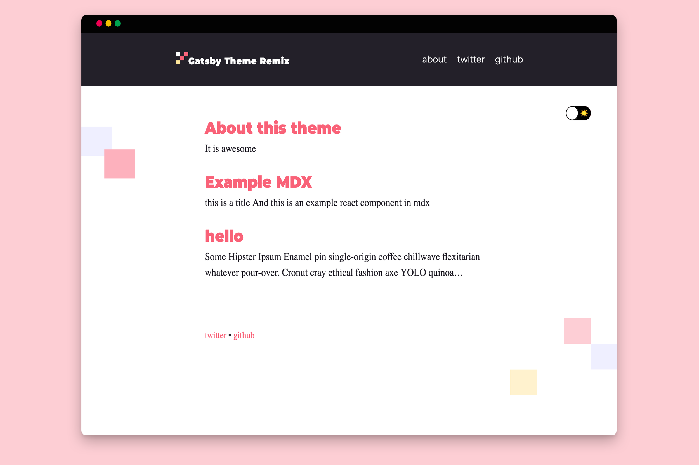

<p align="center">
  <a href="https://gatsby-theme-blog-remix-demo.netlify.com">
    
  </a>
</p>
<h1 align="center">
  The Gatsby blog theme <i>Remixed</i>
</h1>



A remix of the classic Gatsby Blog Theme.

## Why this theme?

This theme took the tried and true Gatsby Theme Blog and added a splash of style and color. This theme does not do anything ground breaking but it is a great jumping off point. The theme's components are all easily shadowable, and have been themed by theme-ui to make the customization of easy as possible.

### Features

- Theme-ui
- Easy to shadow components
- Pre-built name-spaced component shadowing folder
- Light and Darkmode
- MDX support
- Desktop and Mobile Navigation component
- Portals

## Installation

### Use the blog remixed theme starter in a new site

This will generate a new site that pre-configures use of the blog theme.

```sh
gatsby new my-themed-blog https://github.com/joshatoutthink/gatsby-theme-blog-remix-demo
```

### Manually add to your site

```sh
npm install --save @joshkennedy00/gatsby-theme-blog-remix
```

## Usage

### Theme options

| Key           | Default value     | Description                                                                                               |
| ------------- | ----------------- | --------------------------------------------------------------------------------------------------------- |
| `basePath`    | `/`               | Root url for all blog posts                                                                               |
| `contentPath` | `/content/posts`  | Location of blog posts                                                                                    |
| `assetPath`   | `/content/assets` | Location of assets                                                                                        |
| `mdx`         | `true`            | Configure `gatsby-plugin-mdx` (if your website already is using the plugin pass `false` to turn this off) |

---

#### Example usage

```js
// gatsby-config.js
module.exports = {
  plugins: [
    {
      resolve: `gatsby-theme-blog`,
      options: {
        // basePath defaults to `/`
        basePath: `/blog`,
      },
    },
  ],
};
```

---

### Additional configuration

#### Site Metadata

In addition to the theme options, there are a handful of items you can customize via the `siteMetadata` object in your site's `gatsby-config.js`

```js
// gatsby-config.js
module.exports = {
  siteMetadata: {
    // Used for the site title and SEO
    title: `Gatsby Theme Remix`,
    // Used to provide alt text for your avatar
    author: `Josh Kennedy`,
    //used in the post footer
    shortBio: `a web designer and developer.`,
    // Used for SEO
    description: `This is a remix of the theme Gatsby Theme Blog. Changed some styling, added some components, also made extra comments to make extending this theme easier`,
    // Used for social links in the root footer
    social: [
      {
        name: `twitter`,
        url: `https://twitter.com/JoshKen08672181`,
      },
      {
        name: `github`,
        url: `https://github.com/joshatoutthink`,
      },
    ],
  },
};
```

#### Images

this theme comes with the option to add:

- site logo
- author avatar

##### Site logo

- Place a svg, jpg, or png named _logo_ in the assets folder.

- There is also the option to add a darkmode version of the logo. To add this logo maker sure to name it _logo-dark_.

##### Author Avatar

- Place a jpg, or png named avatar in the assets folder.

## Customize Components

this theme's layout uses theme-ui's layout components. Within those components exists modular components that makes it easy to shadow, and create your own remix.

### Theme-ui

[ add theme-ui docs and example ]

### Shadowing a Component

To shadow a component or edit the components from this theme you copy the component into your site with this folder structure:

```
./src/THEMENAME/components
```

However this theme Prebuilds a name-spaced folder in your source folder for you. All you have to do is paste in the components into the prebuild name-spaced components folder. All maker all paths reference other compents change from

```JS
import Navigation from './Navigation'
```

to

```JS
import { Navigation } from '@joshkennedy00/gatsby-theme-blog-remix'
```

once the component is copied over you can delete, add, and edit till you are blue in the face.

<!-- Todos ( remove in production) -->

- [x] set up site to be remix with all site metadata
- [x] add logo to blog header
- [x] change primary colors to samon and orange
- [x] add menu to header
- [x] add mobil menu with portal
- [x] add artwork remix graphic
- [x] change favicon to grapic
- [ ] export all components that should be shadowable form index.js in theme
- [ ] theme options
- [ ] components
  - [ ] props
  - [ ] component shadowing examples
- [x] create default images and metadata as placeholder
- [ ] comment like crazy all code
  - [x] components
  - [ ] templates
  - [x] config
  - [ ] gatsby node
  - [ ] theme ui
- [ ] create a real readme
- [ ] copy and paste readme in all places
- [ ] configure demo site index page to be a learning resource
- [x] deploy and setup on netlify
- [ ] run through checklist
